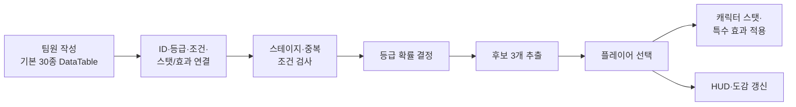

# Survive From Museum

> 장신구 빌드를 완성하며 5개 시대의 보스를 공략하는 Unreal Engine 5 기반 3D 탑뷰 액션 게임


[Steam에서 플레이](https://store.steampowered.com/app/3991210/Survive_From_Museum/) · [플레이 영상](https://youtu.be/tjT9lYLo7KM) · [전체 포트폴리오](https://hwang-doyeon-game-dev.hwangdy135.chatgpt.site/) · [상세 개발 기록](https://app.notion.com/p/294f1fce5d1682988e79815ab13ad574)

<p align="center">
  
</p>

## 프로젝트 개요

| 항목 | 내용 |
| --- | --- |
| 개발 기간 | 2024.07–2025.11.06 |
| 팀 구성 | 4인 팀 · 팀장 · 개인 기여도 약 30% |
| 담당 | PM · 게임 기획 · 클라이언트 기능 · Steam 출시 관리 |
| 장르 / 플랫폼 | 3D 탑뷰 뱀파이어 서바이벌 라이크 / PC |
| 엔진 / 기술 | Unreal Engine 5.3 · C++ · Blueprint · DataTable |
| 주요 성과 | 2025 PlayX4 전시 · 2025.10.25 Steam 정식 출시 |

게임 박물관 지하에 생긴 던전을 탐험하고, 각 시대의 게임에 남은 사념체를 성불시키는 게임입니다. 제한 시간만 버티는 방식이 아니라 **각 스테이지의 보스를 처치해야 다음 단계로 진행**됩니다. 등급·등장 조건·스탯 증감·세트 옵션이 다른 장신구를 선택해 매 플레이의 빌드를 구성합니다.

### 핵심 플레이 흐름

**무기 선택 → 스테이지 선택 → 전투 → 경험치 획득 → 레벨업 → 장신구 선택 → 캐릭터 강화 → 보스 공략**

### 게임의 차별점

- 보스 처치를 명확한 스테이지 완료 목표로 둔 진행 구조
- 장신구의 등급·조건·세트 옵션에 따라 달라지는 성장 빌드
- 스테이지 진행과 수집 상태를 연결해 다음 플레이 목표를 제공하는 도감

## 플레이 화면

| 전투와 상호작용 | 성장 선택 |
| --- | --- |
|  |  |
|  |  |

## 담당 역할과 팀 작업 경계

### 내가 담당한 범위

- 단순 스탯 자동 상승을 **장신구 3개 중 하나를 선택하는 성장 구조**로 변경
- 일반·희귀·전설 등급, 스테이지·중복 조건, 세트 옵션 등 장신구 규칙 설계
- 장신구 데이터와 캐릭터 스탯·특수 효과·HUD·도감의 연결 및 검증
- Blueprint 기반 장신구 선택 UI, HUD, 옵션·결과, 창고·도감 화면 연결
- 팀 일정, 주간 회의, PlayX4 전시와 Steamworks 출시 과정 관리

### 기여 범위의 경계

- 장신구 30종의 **기본 DataTable 행은 팀원이 작성**했습니다.
- 저는 해당 데이터를 바탕으로 ID, 등급, 등장 조건, 아이콘, 스탯 증감값과 특수 효과를 게임 기능에 연결하고 조건 처리와 결과를 검증했습니다.
- C++는 **AI가 생성한 초안을 출발점**으로 사용했습니다. 제 기여는 규칙 설계, 초안 검토, 디버깅 로그와 반복 테스트, 누락 로직 수정 및 최종 동작 확인입니다.

## 대표 시스템: 장신구 기반 캐릭터 성장



장신구의 정적 데이터와 런타임 적용 결과가 서로 어긋나지 않도록, 후보 생성부터 UI 반영까지를 하나의 검증 흐름으로 보았습니다.

- **데이터:** ID, 등급, 스테이지·중복 조건, 아이콘, 스탯 증감값, 특수 효과
- **후보 생성:** 조건 검사 → 등급 결정 → 통과 범위에서 3개 추출
- **선택 결과:** 캐릭터 스탯·특수 효과 적용 → HUD·도감 갱신

### 디버깅 사례: 조건을 만족한 장신구가 나오지 않는 문제

| 단계 | 내용 |
| --- | --- |
| 현상 | 검사 조건이 늘어난 뒤 일부 장신구가 후보에서 빠지고 등급 무작위 결정이 누락됨 |
| 추적 | 조건 통과·제외 사유와 장신구 효과 적용 여부를 디버깅 로그로 분리해 확인 |
| 수정 | 스테이지·중복 조건 검사와 등급 추출 과정에서 빠진 지점을 찾아 보완 |
| 검증 | 조건 조합을 바꾸어 반복 테스트하고 로그와 상세 스탯·특수 효과·UI 결과를 대조 |
| 결과 | 조건을 만족한 후보가 추출되고 선택 결과가 캐릭터와 UI에 일관되게 반영되는 흐름 완성 |

이 경험을 통해 “데이터가 존재하는가”와 “데이터가 모든 조건을 지나 실제 결과에 반영되는가”를 별도로 검증해야 한다는 점을 배웠습니다.

## 클라이언트 기능과 UI

- 대시 무적·쿨다운, 경험치 오브젝트와 자석, 상태 이상 기능 보완
- 마우스 포인터·감도, 상호작용 표시, 상세 스탯, 튜토리얼 개선
- 스테이지 전용 장신구와 세트 효과 제작
- 5스테이지 게이트 타이머와 맵 기믹 제작
- 결과 화면과 장신구 도감으로 전투 결과와 수집 상태를 연결

## 플레이 테스트에서 출시까지

### PlayX4 피드백 반영

2025 PlayX4에서 4일간 약 **150회의 체험 플레이**를 운영했습니다. 현장 의견을 캐릭터·상호작용·무기·장신구·스테이지·UI·튜토리얼·버그로 분류하고, 일정과 핵심 경험에 미치는 효과를 기준으로 반영 여부를 결정했습니다.

| 확인한 문제 | 적용한 개선 | 확인 기준 |
| --- | --- | --- |
| 일반 전투의 반복감 | 몬스터 수 증가·체력 감소, 맵 패턴 주기 60초 → 30초 | 스테이지당 평균 목표 레벨 25 |
| 장신구별 차이가 작음 | 등급별 시각 효과, 스테이지 전용 효과와 세트 옵션 추가 | 선택 결과의 체감과 빌드 차이 |
| 상호작용 인지가 어려움 | 획득 범위 확대, 화살표·VFX·교체 안내와 튜토리얼 추가 | 드랍 무기 발견과 교체 성공 여부 |
| HUD와 상세 정보 부족 | 스탯 변화, 장신구 툴팁, 창고·도감 설명과 감도 옵션 추가 | 수치 변화와 아이템 효과 인지 여부 |

난이도 세분화와 장신구 리롤은 개발 범위와 핵심 경험을 고려해 제외했습니다. 피드백을 **분류 → 우선순위 결정 → 기획 수정 → 기능 반영 → 내부 재검증**의 과정으로 운영했습니다.

### PM과 출시

- Git, Notion, Google Docs로 작업·회의·의사결정 기록 관리
- 주 1회 정기 회의에서 완료 항목과 다음 작업을 담당자별로 점검
- 각자의 테스트 월드에서 작업한 뒤 통합하는 흐름 운영
- 개발 중 약 **20회의 내부 플레이 테스트** 진행
- Steamworks 등록, 상점 페이지, 심의, 빌드 제출과 다운로드 검증 관리
- 게임제작업 등록으로 일정이 약 1개월 늘어나자 전체 로드맵 재조정
- 2025.10.25 Steam 정식 출시 후 **5회의 버그 수정** 진행

## AI 활용과 검증 책임

이 프로젝트의 C++를 모두 직접 작성했다고 표현하지 않습니다.

1. 장신구 규칙과 데이터-기능 연결 목표를 먼저 정의했습니다.
2. AI가 생성한 C++ 초안을 검토해 실제 프로젝트에 적용했습니다.
3. 조건 통과·제외 사유와 효과 적용 여부를 로그로 추적했습니다.
4. 장신구별 캐릭터 스탯·특수 효과·UI 결과를 직접 반복 테스트했습니다.
5. 확인한 조건·등급·스탯 누락 지점을 수정하고 다시 검증했습니다.

즉, AI는 코드 초안을 만드는 도구로 사용했고, **설계 의도와 구현 결과가 일치하는지 판단하고 검증하는 책임**은 제가 맡았습니다.

## 실행 및 빌드

```bash
git clone https://github.com/doyeon-SM/AGSD_HYGL.git
```

1. Unreal Engine **5.3** 환경에서 `AGSD.uproject`를 엽니다.
2. 에셋과 플러그인 의존성 로딩이 끝난 뒤 프로젝트 설정과 시작 맵을 확인합니다.
3. 저장소에는 Unreal Engine 프로젝트 소스와 `Content`가 포함되어 있어 최초 복제와 임포트에 시간이 걸릴 수 있습니다.

완성 빌드는 [Steam 상점](https://store.steampowered.com/app/3991210/Survive_From_Museum/)에서 설치해 플레이할 수 있습니다. 실제 플레이는 [플레이 영상](https://youtu.be/tjT9lYLo7KM), 구현 근거와 개발 기록은 [Notion 상세 페이지](https://app.notion.com/p/294f1fce5d1682988e79815ab13ad574)에서 확인할 수 있습니다.

## 한계와 배운 점

- 장신구 데이터와 조건 처리를 기능 확장 뒤에 보완하면서, 초기부터 ID 체계와 조건 평가 순서를 설계해야 한다는 점을 배웠습니다.
- 다시 구현한다면 Dictionary 기반 조회와 데이터 검증 규칙을 먼저 정의해 누락과 잘못된 참조를 조기에 발견하겠습니다.
- 반복 생성·파괴되는 몬스터에는 오브젝트 풀링을 적용해 생성 비용을 관리하겠습니다.
- 출시 가능한 범위에 집중하면서 콘텐츠 분량과 일부 기획을 줄였습니다. 다음 개발에서는 스탯 조합과 보스 패턴을 확장하되 테스트 가능한 단위로 범위를 나누겠습니다.

## 링크

- [Steam — Survive From Museum](https://store.steampowered.com/app/3991210/Survive_From_Museum/)
- [YouTube — 플레이 영상](https://youtu.be/tjT9lYLo7KM)
- [황도연 게임 개발 포트폴리오](https://hwang-doyeon-game-dev.hwangdy135.chatgpt.site/)
- [Notion — 상세 개발 기록](https://app.notion.com/p/294f1fce5d1682988e79815ab13ad574)
